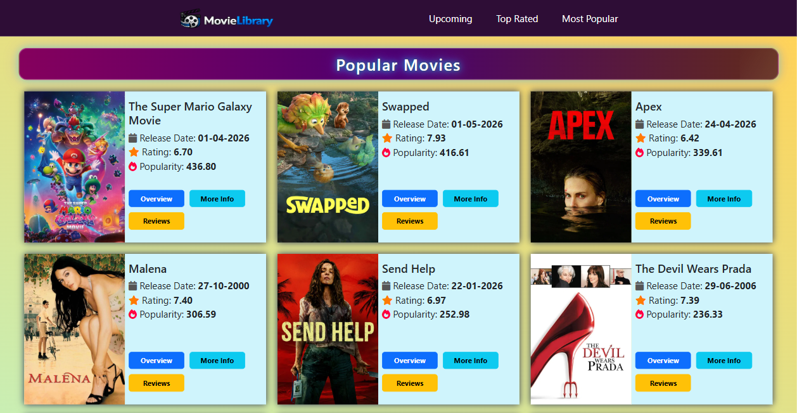
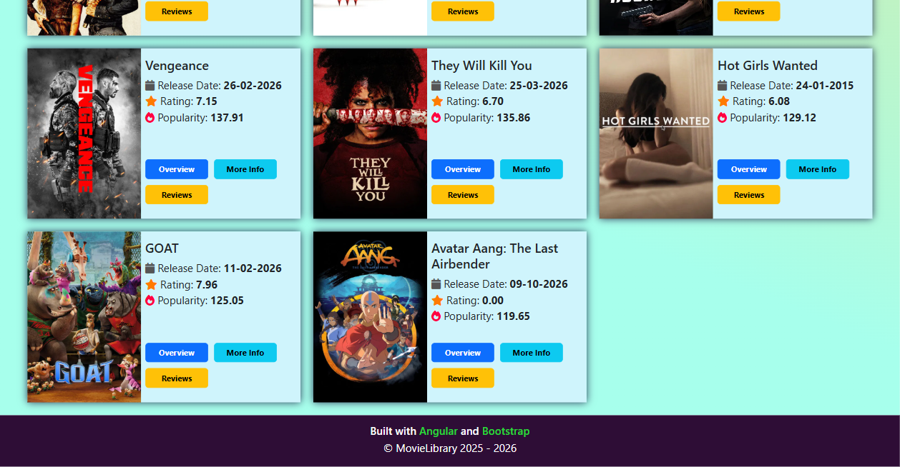
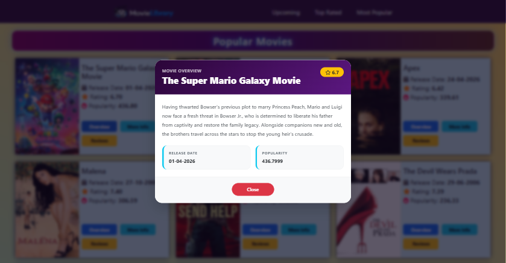
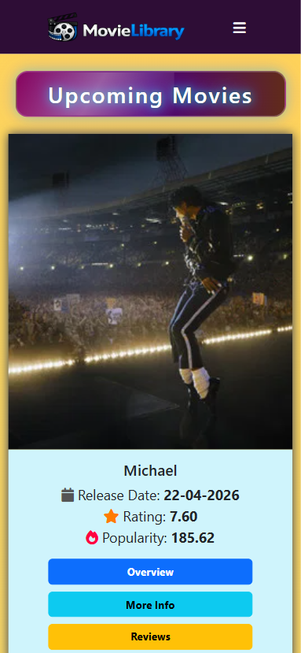
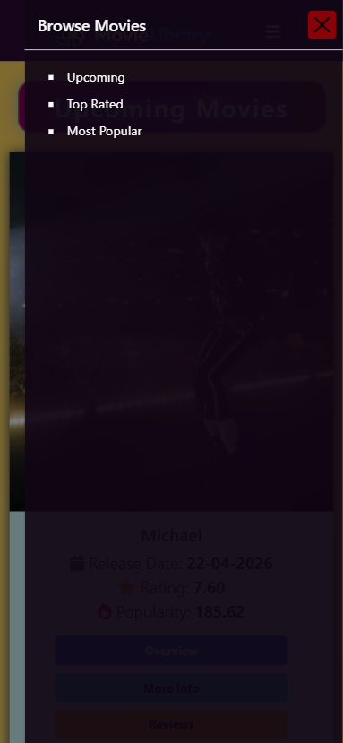
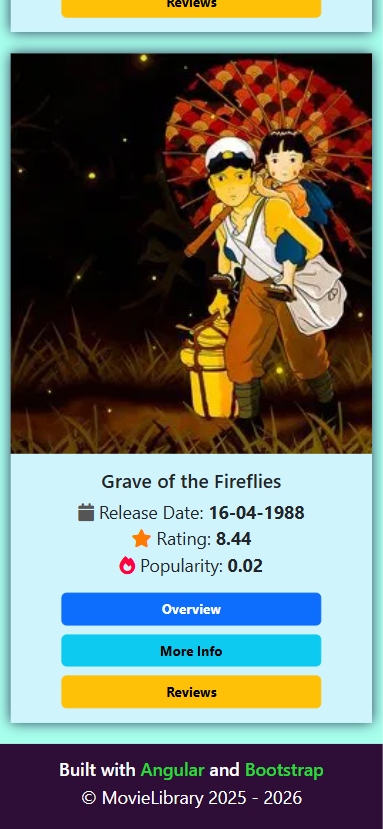
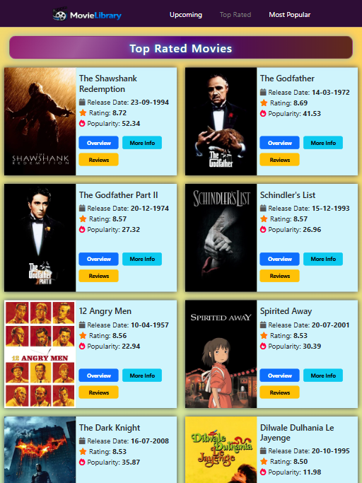
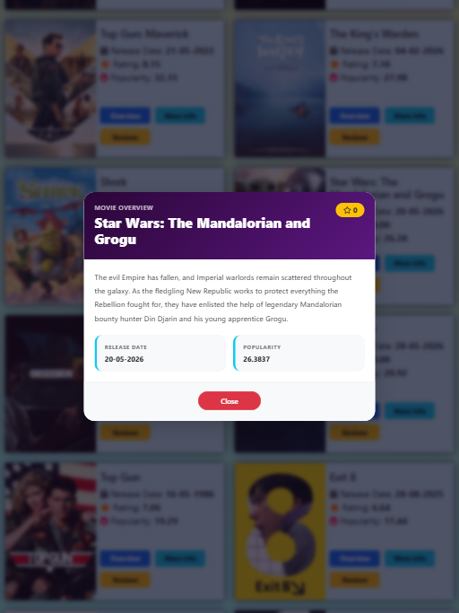

 <!-- banner height: 150px, width: 1000px -->

MovieLibrary is a frontend app that uses <a href="https://www.themoviedb.org" target="_blank">TMDB API</a> to fetch and display movie data. Users can browse movies, view movie details such as posters, ratings, release dates and descriptions through a clean, modern UI. The app currently makes use of the following API movie categories: Rated, popular and upcoming.

## Setup Instructions
Make sure you have **Node.js** already installed for dependency management.

#### 1. Clone the Repository:
Select your desired file directory, then enter the following commands in terminal:
```
git clone https://github.com/vkumar-2/angular-movielibrary.git
cd angular-movielibrary
npm install
```

Note:<br>
`npm install` installs dependencies and only needs to be performed for first time installation.

#### 2. Add TMDB API Key:
a) Go to: `src/app/main/api/api_key_example.ts`<br>
b) Replace `your_tmdb_api_key` with your API key.<br>
c) Rename the file to `api_key`.

Note:<br>
Create an account on <a href="https://www.themoviedb.org" target="_blank">TMDB</a> to obtain your own API key.

#### 3. Access localhost URL:
Run `npm start` to start the Angular development server. Then open your browser and go to http://localhost:4200 . Alternatively: If you're using the Angular CLI, run `ng serve` to start development server.

## Frameworks & APIs
### Angular
TypeScript-based framework used to provide the overall structure and architecture of the application through components, services, routing, and data binding.

### Bootstrap
CSS library used to build the app’s responsive layout. Bootstrap components such as buttons, cards, and grids help improve the app’s UI/UX and maintain visual consistency across different screen sizes.

### TMDB API
The Movie Database API: Used to fetch current movie data including titles, posters, ratings, release dates and descriptions. Movie data is then rendered dynamically in the app.

## Image Gallery
| Desktop 1 |
| ------------ |
|  |

| Desktop 2 |
| ------------ |
|  |

| Desktop 3 |
| ------------ |
|  |

| Smartphone 1 | Smartphone 2 | Smartphone 3 |
| ------------ | ------------ | ------------ |
|  |  |  |

| Tablet 1 | Tablet 2 |
| ------------ | ------------ |
|  |  |